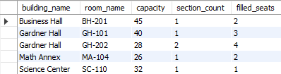

# College Database EER Diagram

_EER DIAGRAM_

---

## Table of Contents

- [Project Overview](#project-overview)
- [Tables and Descriptions](#tables-and-descriptions)
- [Common Columns](#common-columns)
- [Relationships](#relationships)
- [Views](#views)
- [Functions](#functions)
- [Stored Procedures](#stored-procedures)
- [Authors](#authors)

---

## Project Overview

  
  

This project is a classroom assignment that models a college database using an Enhanced Entity-Relationship (EER) diagram.  
It captures data about users, students, employees, departments, courses, semesters, sections, rooms, buildings, enrollments, and grades.  
To simplify data retrieval and support common queries, several SQL views were added. These views join related tables to present combined information—such as student enrollments, instructor course assignments, and course offerings per semester—making it easier to analyze and display data without writing complex joins in every query.

The database is designed to:

- Track users who may be students, employees, or other.
- Manage course offerings, enrollments, and grades.
- Handle departmental and building assignments.
- Support classroom scheduling and room assignments.

---

| Table Name     | Description                                                                                                                                                       |
| -------------- | ----------------------------------------------------------------------------------------------------------------------------------------------------------------- |
| `user`         | Represents a person associated with the university (student, employee, or other). Stores personal info like name, date of birth, contact info, and university ID. |
| `student`      | Represents a student enrolled at the university; each student corresponds to a `user`. Tracks admission date, GPA, and current status.                            |
| `employee`     | Represents a university employee, including faculty or staff. Each employee corresponds to a `user` and belongs to a `department` and has a `role`.               |
| `department`   | Represents an academic or administrative department at the university.                                                                                            |
| `role`         | Represents a role assigned to an employee (e.g., Professor, Administrator).                                                                                       |
| `status`       | Represents the status of a student (e.g., Active, Alumnus, Leave of Absence).                                                                                     |
| `course`       | Represents an academic course offered by the university. Includes course name, description, and whether it is currently active.                                   |
| `semester`     | Represents a university semester, including term (e.g., Fall) and year.                                                                                           |
| `section`      | Represents a course section offered during a semester, taught by an employee (instructor), with day(s) of the week and start/end times.                           |
| `enrollment`   | Represents a student's enrollment in a specific section.                                                                                                          |
| `grade_type`   | Represents the type of a grade (e.g., Midterm, Final, Project).                                                                                                   |
| `grade`        | Represents a grade assigned to a student's enrollment in a section, linked to a `grade_type`.                                                                     |
| `building`     | Represents a university building, including its name, campus, and a supervising employee.                                                                         |
| `room`         | Represents a room within a building, with capacity and optional description.                                                                                      |
| `section_room` | Represents the many-to-many relationship between `section`s and `room`s. Allows a section to be assigned to multiple rooms and a room to host multiple sections.  |

## Tables and Descriptions

### `user`

**Columns:**

- `id` (PK) – Unique identifier
- `first_name`, `last_name` – Name of the user
- `dob` – Date of birth
- `address`, `email`, `phone_number`, `ssn` – Contact and identification information
- `university_id` – Unique university-specific identifier

---

### `student`

**Columns:**

- `id` (PK) – Unique identifier
- `user_id` (FK → `user.id`) – Associated user
- `admission_date` – Date of admission
- `gpa` – Current grade point average
- `status` (FK → `status.id`) – Current student status (e.g., Active, Alumnus)

---

### `employee`

**Columns:**

- `id` (PK) – Unique identifier
- `user_id` (FK → `user.id`) – Associated user
- `department_id` (FK → `department.id`) – Department where the employee works
- `role_id` (FK → `role.id`) – Role or job title

---

### `department`

**Columns:**

- `id` (PK) – Unique identifier
- `name` – Department name

---

### `role`

**Columns:**

- `id` (PK) – Unique identifier
- `name` – Role name (e.g., Professor, Administrator)
- `description` – Optional description of the role

---

### `status`

**Columns:**

- `id` (PK) – Unique identifier
- `label` – Status label (e.g., Active, Alumnus)
- `description` – Explanation of the status

---

### `grade_type`

**Columns:**

- `id` (PK) – Unique identifier
- `name` – Grade type (e.g., Midterm, Final, Project)

---

### `grade`

**Columns:**

- `id` (PK) – Unique identifier
- `letter` – Letter grade (e.g., A, B, C)
- `enrollment_id` (FK → `enrollment.id`) – Enrollment associated with this grade
- `type` (FK → `grade_type.id`) – Type of the grade

---

### `enrollment`

**Columns:**

- `id` (PK) – Unique identifier
- `student_id` (FK → `student.id`) – Enrolled student
- `section_id` (FK → `section.id`) – Section the student is enrolled in

---

### `section`

**Columns:**

- `id` (PK) – Unique identifier
- `semester_id` (FK → `semester.id`) – Semester the section is offered in
- `course_id` (FK → `course.id`) – Associated course
- `instructor_id` (FK → `employee.id`) – Instructor assigned to the section
- `dow` – Day(s) of the week
- `start_time`, `end_time` – Scheduled times

---

### `course`

**Columns:**

- `id` (PK) – Unique identifier
- `name` – Course name
- `description` – Course description
- `active` – Indicates if the course is currently active (TINYINT)

---

### `semester`

**Columns:**

- `id` (PK) – Unique identifier
- `term` – Term name (e.g., Fall, Spring)
- `year` – Calendar year

---

### `building`

**Columns:**

- `id` (PK) – Unique identifier
- `name` – Building name
- `building_supervisor` (FK → `employee.id`) – Employee supervising the building
- `campus` – Campus location

---

### `room`

**Columns:**

- `id` (PK) – Unique identifier
- `name` – Room name or number
- `building` (FK → `building.id`) – Building containing the room
- `capacity` – Number of occupants the room can hold
- `description` – Additional notes about the room

---

### `section_room`

**Columns:**

- `id` (PK) – Unique identifier
- `room_id` (FK → `room.id`) – Assigned room
- `section_id` (FK → `section.id`) – Section scheduled in the room

---

## Common Columns

All tables include the following audit columns:

- `created` (TIMESTAMP) – Record creation timestamp
- `created_userid` (INT) – User ID who created the record
- `updated` (TIMESTAMP) – Last update timestamp
- `updated_userid` (INT) – User ID who last updated the record

---

## Relationships

- `user` → `student` / `employee` (1-to-0..1)
- `student` → `status` (many-to-1)
- `student` → `enrollment` (1-to-many)
- `enrollment` → `grade` (1-to-many)
- `grade` → `grade_type` (many-to-1)
- `employee` → `department` / `role` (many-to-1)
- `building` → `employee` (`building_supervisor`) (many-to-1)
- `room` → `building` (many-to-1)
- `section` → `course` / `semester` / `employee` (`instructor_id`) (many-to-1)
- `section_room` → `section` / `room` (many-to-many)

---

## Views

### `course_offerings`

**Purpose:**  
Displays all course sections offered in each semester, including instructor, schedule, assigned rooms, and enrollment statistics. Helps administrators and students see available courses, capacities, and remaining seats.  

---

### `available_faculty`

**Purpose:**  
Lists faculty members who are available for teaching assignments. Useful for scheduling new sections or finding substitute instructors.  

---

### `course_grades`

**Purpose:**  
Summarizes grades for each course section, providing a grade distribution overview. Useful for analyzing student performance.  

---

### `student_transcript`

**Purpose:**  
Provides a complete transcript for students, showing courses taken and final grades. Useful for advisors, registrars, and students.  

---

### `student_overview`

**Purpose:**
Provides a general overview of the students, including email, admission date, GPA, and the number of currently enrolled classes Useful if quick information is needed about a student.

---

### `instructor_schedule`

**Purpose:**
Provides a complete list of professors and the classes they teach, the time it takes place, the location, day of the week, and semester it takes place in. Useful to students to see the schedule of any given professor.

---

### `room_utilization`

**Purpose:**
Provides a complete list of all rooms and the amount of sections taking place inside of it. This would be useful for anyone needing to use the room. 

---

### `building_supervisors`

**Purpose:**
Provides a list of all buildings on campus and their supervisors with contact information. This would be helpful for requesting maintenance for the building or for permission to do something in the building.

---

## Functions

### Enrollment & Capacity Management Functions

#### [`f_get_available_seats`](functions/f_get_available_seats.sql)

**Purpose:**  
Calculates the number of available seats remaining in a specific course section.

**Parameters:**

- `sectionId` (INT) – The ID of the section

**Returns:**

- INT – Number of available seats (returns 0 if no seats available)

**Logic:**  
Sums the total capacity of all rooms assigned to the section and subtracts the current enrollment count to determine available seats.

---

#### [`f_get_enrollment_count`](functions/f_get_enrollment_count.sql)

**Purpose:**  
Returns the total number of students currently enrolled in a specific course section.

**Parameters:**

- `section_id` (INT) – The ID of the section

**Returns:**

- INT – Total number of enrolled students

**Logic:**  
Counts all enrollment records for the given section.

---

### Grade & Billing Functions

#### [`f_get_current_grade`](functions/f_get_current_grade.sql)

**Purpose:**  
Calculates a student's current weighted grade in a specific course section based on assignments, quizzes, projects, exams etc.

**Parameters:**

- `student_id` (INT) – The ID of the student
- `section_id` (INT) – The ID of the section

**Returns:**

- VARCHAR(1) – Letter grade (A, B, C, D, F) or NULL if no enrollment found

**Logic:**  
Retrieves all grades for the student's enrollment and applies weighted averages for different grade types (homework, quizzes, projects, midterm, final exam, projects).

---

#### [`f_get_student_semester_bill`](functions/f_get_student_semester_bill.sql)

**Purpose:**  
Calculates the total tuition bill for a student in a specific semester based on enrolled courses and a per-credit fee.

**Parameters:**

- `p_student_id` (INT) – The ID of the student
- `p_term` (VARCHAR(50)) – Term name (e.g., Fall, Spring)
- `p_year` (INT) – Academic year
- `p_per_credit_fee` (DECIMAL(10,2)) – Fee per credit hour

**Returns:**

- DECIMAL(10,2) – Total semester bill (returns 0 if no enrollments)

**Logic:**  
Finds the semester, sums credit hours for all enrolled sections, and multiplies by the per-credit fee.

---

### Data Validation Functions

#### [`f_validate_first_name`](debbie/f_user_data_validation.sql)

**Purpose:**  
Validates a first name for required fields and acceptable characters.

**Parameters:**

- `p_first` (VARCHAR(255)) – The first name to validate

**Returns:**

- VARCHAR(255) – Error message if invalid, NULL if valid

**Validation Rules:**

- First name cannot be NULL or empty
- Must contain only letters, spaces, hyphens, or apostrophes

---

#### [`f_validate_last_name`](debbie/f_user_data_validation.sql)

**Purpose:**  
Validates a last name for required fields and acceptable characters.

**Parameters:**

- `p_last` (VARCHAR(255)) – The last name to validate

**Returns:**

- VARCHAR(255) – Error message if invalid, NULL if valid

**Validation Rules:**

- Last name cannot be NULL or empty
- Must contain only letters, spaces, hyphens, or apostrophes

---

#### [`f_validate_dob`](debbie/f_user_data_validation.sql)

**Purpose:**  
Validates a date of birth to ensure it meets age and logical requirements.

**Parameters:**

- `p_dob` (DATE) – The date of birth to validate

**Returns:**

- VARCHAR(255) – Error message if invalid, NULL if valid

**Validation Rules:**

- Date of birth cannot be NULL
- Cannot be in the future
- User must be at least 14 years old

---

#### [`f_validate_gender`](debbie/f_user_data_validation.sql)

**Purpose:**  
Validates a gender value against approved options.

**Parameters:**

- `p_gender` (CHAR(1)) – The gender to validate (M, F, or X)

**Returns:**

- VARCHAR(255) – Error message if invalid, NULL if valid

**Validation Rules:**

- Must be one of: M (Male), F (Female), or X (Other)

---

## Stored Procedures

### Student Management Procedures

#### [`sp_add_student`](stored_procedures/sp_add_student.sql)

**Purpose:**  
Creates a new student record in the system by inserting both a user and associated student record with comprehensive data validation.

**Parameters:**

_Input:_

- `p_first_name`, `p_last_name` (VARCHAR(100)) – Student's name
- `p_dob` (DATE) – Date of birth
- `p_address`, `p_email`, `p_phone_number` (VARCHAR) – Contact information
- `p_ssn` (INT) – Social Security Number
- `p_university_id` (INT) – Unique university identifier
- `p_created_userid`, `p_updated_userid` (INT) – Audit user IDs
- `p_admission_date` (DATE) – Date of admission
- `p_gpa` (DECIMAL(3,2)) – Initial GPA
- `p_student_status` (VARCHAR(50)) – Student status (e.g., Active)
- `p_department_id` (INT) – Associated department

_Output:_

- `p_new_user_id` (INT) – ID of created user record
- `p_new_student_id` (INT) – ID of created student record

**Logic:**  
Validates all input fields using validation functions, checks for status validity, creates a temporary error table to collect validation messages, and if all validations pass, inserts both the user and student records within a transaction.

**Returns:**  
Returns all validation errors if any issues are found; otherwise commits the transaction and returns the new user and student IDs.

---

#### [`sp_enroll_student`](stored_procedures/sp_enroll_student.sql)

**Purpose:**  
Enrolls an active student in a specific course section for a given semester, with availability and status checks.

**Parameters:**

_Input:_

- `student_id_param` (INT) – The ID of the student to enroll
- `semester_name_param` (VARCHAR(50)) – Term name (e.g., Fall)
- `year_param` (INT) – Academic year
- `course_code_param` (VARCHAR(50)) – Course identifier
- `created_userid_param`, `updated_userid_param` (INT) – Audit user IDs

_Output:_

- `enrollment_id_param` (INT) – ID of new enrollment record
- `valid_section_id_param` (INT) – ID of the enrolled section
- `status_param` (VARCHAR(255)) – Status message

**Logic:**  
Validates that the student is active, looks up the semester and course, finds the appropriate section, checks for duplicate enrollments, verifies available seats, and creates the enrollment record if all checks pass.

**Returns:**  
Success returns the enrollment ID and section ID; failure returns NULL with a descriptive status message.

---

## Authors

- [Nicolas Tagliafichi](https://github.com/nicotaglia14)
- [Enoch Atuahene](https://github.com/Typher7)
